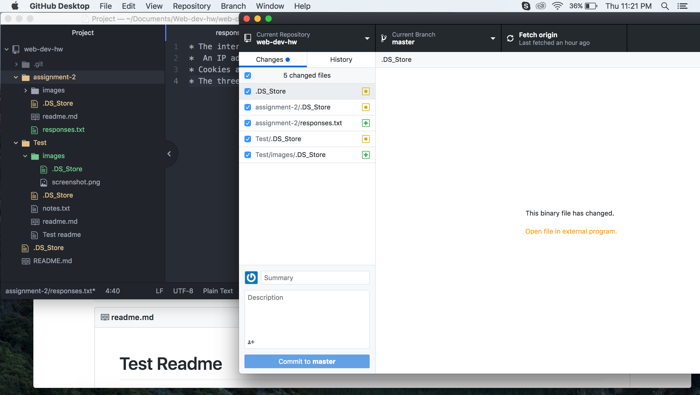

# Assignment 2

A Version Control System is a tool that allows a developer to make changes to a file and to track their changes. It is a software that keeps track of every modification made to the code in a database. We are using a Version Control System in this class because it allows us to see our own change history, to try things and know if they do or do not work well, and to easily go back to what we had working before. Our repositories can easily be integrated with GitHub.com, which will allow us to have built in distributed cloud back up for free, a free hosted webspace, and it allows us to easily see our work/code and track changes we have made during the weekly development cycle.

My [responses](./responses.txt)

Work Summary

* For me, this was a little bit of a struggle. I had to go through the steps several times.
* I first went through all of the steps to read everything.
* Then, I went back to go through it again to thoroughly start my assignment.
* After completing most of the steps, I came across a few major road blocks.
* I think I was mostly second guessing myself, because it turns out, I was doing it right.
* A lot of the steps were a matter of trial and error.
* In the end, I figured most of the assignment out, and can finally complete it all!

