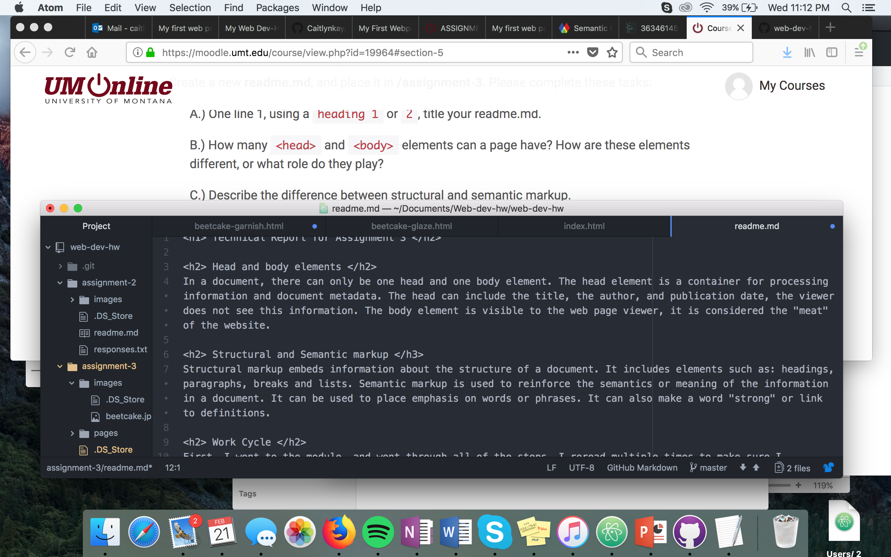

<h1> Technical Report for Assignment 3 </h2>

<h2> Head and body elements </h2>
In a document, there can only be one head and one body element. The head element is a container for processing information and document metadata. The head can include the title, the author, and publication date, the viewer does not see this information. The body element is visible to the web page viewer, it is considered the "meat" of the website.

<h2> Structural and Semantic markup </h3>
Structural markup embeds information about the structure of a document. It includes elements such as: headings, paragraphs, breaks and lists. Semantic markup is used to reinforce the semantics or meaning of the information in a document. It can be used to place emphasis on words or phrases. It can also make a word "strong" or link to definitions.

<h2> Work Cycle </h2>
First, I went to the module, and went through all of the steps. I reread multiple times to make sure I understood everything. I then went to moodle and started the assignment. I created a new project folder, and created three files. I also created an image folder. I then sat down for 5 hours and did this project. This weeks assignment was more time consuming than difficult for me.

