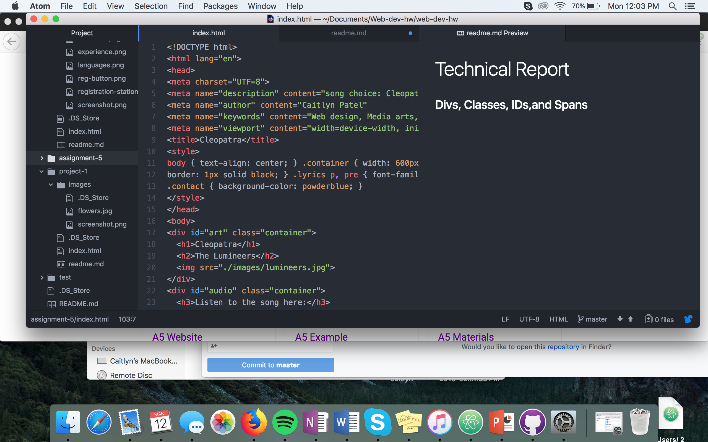

# Technical Report

### Divs, Classes, IDs,and Spans
The <b>div element</b> is used to increase structural clarity and identify element groups. It offers a block-level element to group other elements together. The <b>ID attribute</b> are unique "indentifiers" that are used in order to identify a specific element. The <b>class attribute</b> groups similar types of elements together by using the same unique name value. Also, it serves to visually inform developers that certain elements content similar types of content or serve a similar function on a page. The <b>span element</b> is similar to the div element, spans can exist within divs. Spans are used for extra styling.

### Why might I consider third-party over self-hosted media?
Web hosting companies often charge extra if you use a lot of bandwidth, and due to the size of most movie files, this can occur easily when self-hosting. Third-party options provide you affordable solutions to this potential problem. You may choose third-party options over self-hosted media because web hosting companies often charge extra money if you use a lot of bandwidth and because of the size of most movie files, this can occur easily when self-hosting. Whereas, with <b>third-party</b> options provide you affordable solutions. Also, you can upload a high-quality version of your media and these sites will handle compatibility, encoding, and other details necessary for the media to play on a variety of browsers.

### Work Cycle
For this assignment, I started how I usually start; by checking moodle and going through all of the materials. I first go through Module project 2, topic 6. I then, downloaded the A5 materials. I started my index.html, and went through each step. Eventually after I finished all of the steps, I went through my live page, and went back and fixed any mistakes. It was really exciting putting my assignment together, I loved how it turned out.

