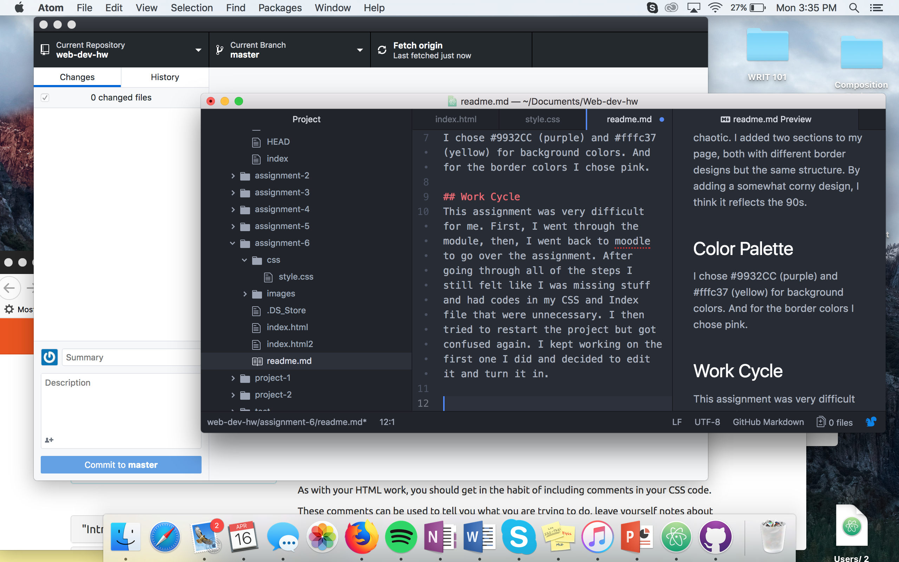

# Technical Report

## Design Process
I chose to do the 90s because I'm a 90s baby! By adding bright colors like, yellow, pink and purple, I contributed to my 90s theme. I tried to make my page somewhat organized so it wouldn't look too chaotic. I added two sections to my page, both with different border designs but the same structure. By adding a somewhat corny design, I think it reflects the 90s.

## Color Palette
I chose #9932CC (purple) and #fffc37 (yellow) for background colors. And for the border colors I chose pink.

## Work Cycle
This assignment was very difficult for me. First, I went through the module, then, I went back to moodle to go over the assignment. After going through all of the steps I still felt like I was missing stuff and had codes in my CSS and Index file that were unnecessary. I then tried to restart the project but got confused again. I kept working on the first one I did and decided to edit it and turn it in.

