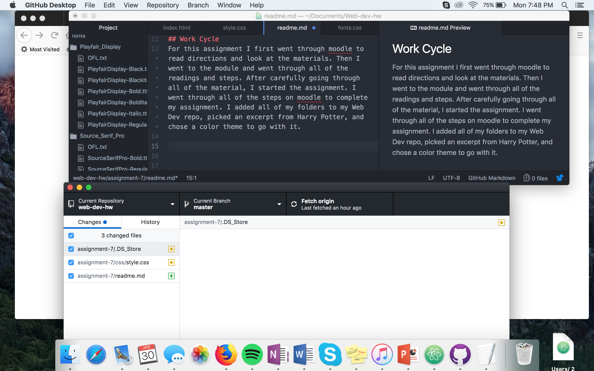

# Technical Report

## Design Process & Fonts
For my color theme I decided to do purple and orange, because looking at the cover of Harry Potter And The Sorcerer's Stone you see tones of orange and purple. I decided to use Play Fair Display and Source Serif Pro as my two fonts because they are both very classic looking, and look good with my Harry Potter Theme.

## The difference between System Font, Web Font and Web-Safe font
System fonts are those already installed on your local device and system, most of these fonts are not set up for the web. Web fonts are custom fonts hosted on a server. A majority of websites use web fonts. Web fonts are not full-proof, although they are optimized for performing on the web. Web-safe fonts are fonts we can count on being available (for example, Times New Roman).

## Fallback fonts
The importance of having a fallback font is that if for whatever reason the font of your choice fails, the browser will try and load the next choice of font.

## Work Cycle
For this assignment I first went through moodle to  read directions and look at the materials. Then I went to the module and went through all of the readings and steps. After carefully going through all of the material, I started the assignment. I went through all of the steps on moodle to complete my assignment. I added all of my folders to my Web Dev repo, picked an excerpt from Harry Potter, and chose a color theme to go with it.

