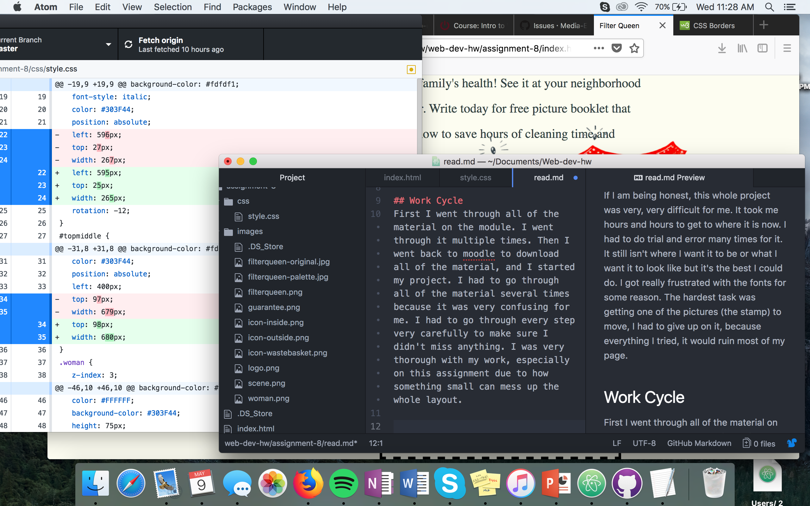

# Technical Report

## Padding, Margins and Borders
Padding is the amount of space between the inner content and the padding itself. A border is an element that you can style the width and color, that goes around whatever you want it to, whether it's text or a picture. It encloses something within the border. Margins are the space between the element and other elements.

## Hardest task
If I am being honest, this whole project was very, very difficult for me. It took me hours and hours to get to where it is now. I had to do trial and error many times for it. It still isn't where I want it to be or what I want it to look like but it's the best I could do. I got really frustrated with the fonts for some reason. The hardest task was getting one of the pictures (the stamp) to move, I had to give up on it, because everything I tried, it would ruin most of my page.

## Work Cycle
First I went through all of the material on the module. I went through it multiple times. Then I went back to moodle to download all of the material, and I started my project. I had to go through all of the material several times because it was very confusing for me. I had to go through every step very carefully to make sure I didn't miss anything. I was very thorough with my work, especially on this assignment due to how something small can mess up the whole layout.

