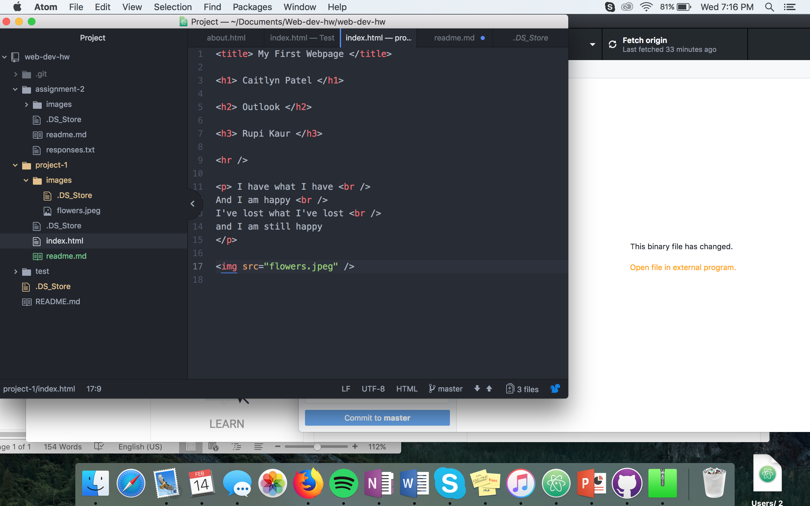

# Technical Report

## Browsers
I use Safari on my iphone to surf the internet. But on my macbook, I use firefox. A web browser is a software program used to access internet from a device.

The Wayback Machine was a really cool site to explore on. I viewed a snapshot of google in 1999. Google in 1999 looked very out-dated and has lots of links at the bottom of the page. The design has stayed somewhat the same, google in the center, with the search button having the option of "google search" or "I'm feeling lucky," but now, google will have different looking logo's on certain days. For example, when searched on February 14th, 2018, the icon is Valentine's day themed.

### My work cycle:
I started out by going through all of the readings. Then I went through all of the steps. I came across a few issues, including my images not showing up on my site, not being able link my assignments on my webpage and trying to figure out how to code correctly (knowing the difference between markdown and HTML).

