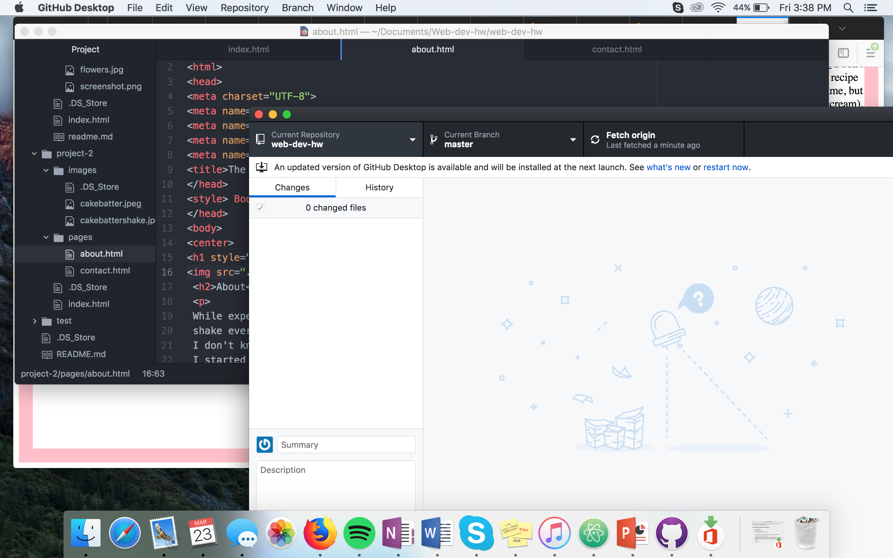

# Technical Report

### Learning html
Everything that I learned about html was brand new for me. Overall, it was a little easier than I expected. After doing stuff multiple times it starts to become more natural for me. It's pretty satisfying after coding and then looking at the site you created.

### Next Topic
When it comes to web design, I think learning anything new is pretty exciting. I feel like each topic we learn I become more and more confident in web design.

### Work Cycle
For this assignment it took me a lot longer than all of the others. I first went through all of the previous materials and reviewed them. I then created my project 2 folder. I started the assignment and worked on it within a few days. I had to go through the instructions a few times to make sure I didn't miss anything (hopefully I didn't), and fixed everything that needed to be fixed.

